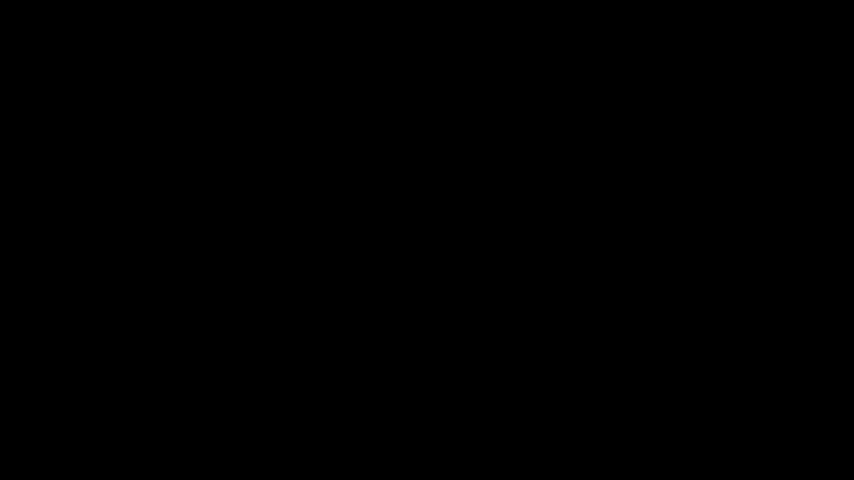
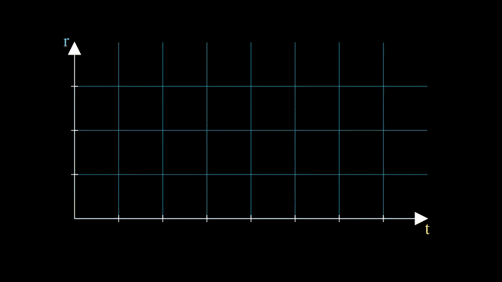
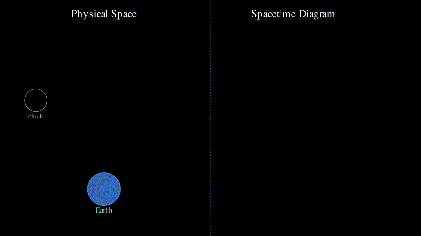
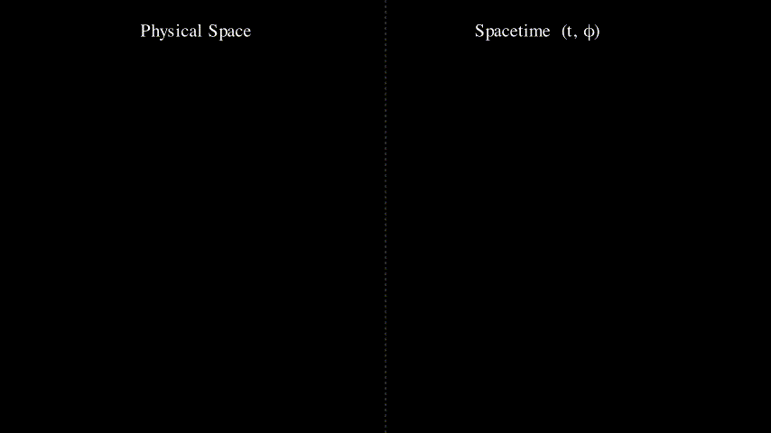
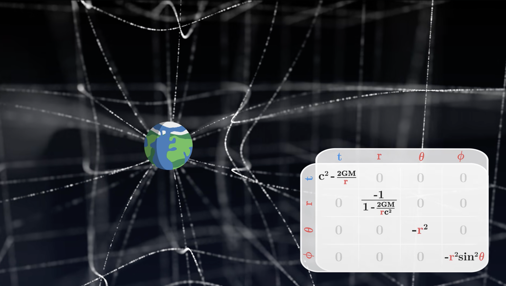
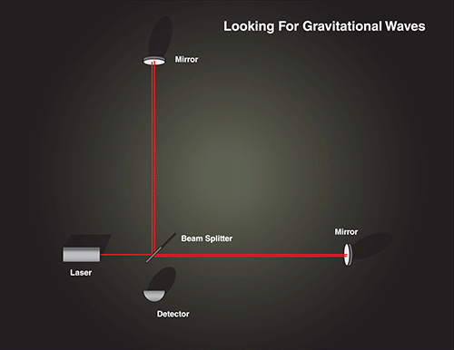
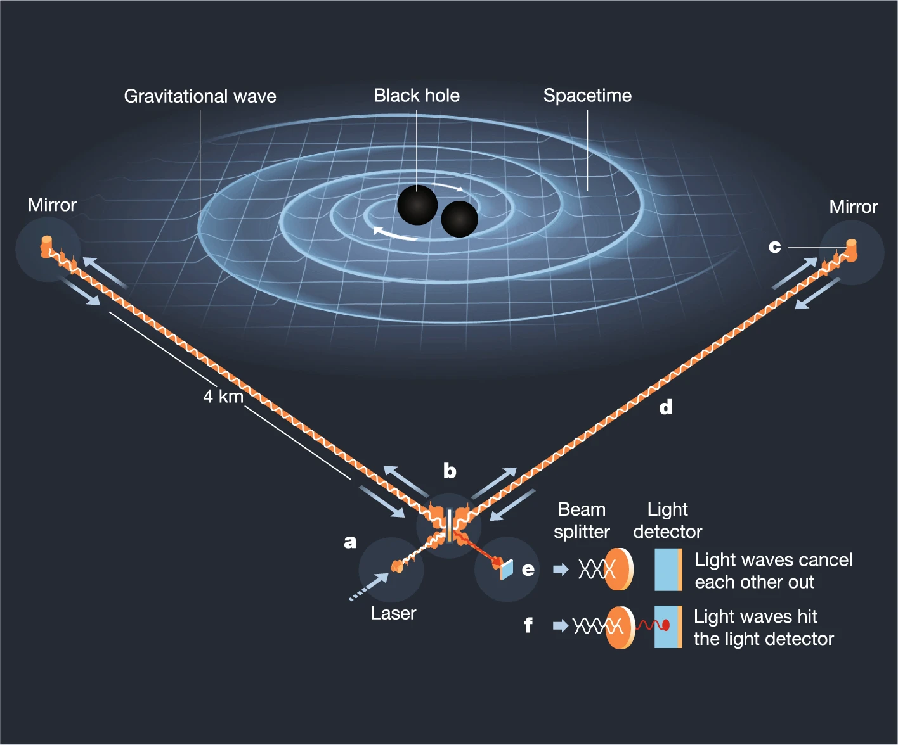

# General Relativity — Intuitive Lecture Notes

---

## Part 1 — Spacetime and World Lines

---

### 1.1  Einstein's Two Postulates

Everything in General Relativity is built on two simple ideas:

> **① The laws of physics are the same in every inertial (non-accelerating) frame of reference.**
>
> **② The speed of light $c$ is the same for every observer, regardless of their motion.**

These sound innocent. Their consequences are not.

---

### 1.2  The Spacetime Sheet

Imagine a flat sheet of graph paper. Draw two axes on it:

- **Horizontal axis — $t$ (coordinate time):** time as measured by a distant, stationary clock.
- **Vertical axis — $r$ (position):** the particle's location in 1-D space.

Every **point** $(t, r)$ on this sheet is called an **event** — a specific place at a specific moment.

This 2-D sheet is **spacetime** in 1+1 dimensions (one space + one time).

> **Key insight:** the grid is not just a bookkeeping device. It *is* the arena in which physics takes place.

---

### 1.3  The World Line

A particle does not sit at a single event — it moves through spacetime. As time advances the particle traces a continuous curve on the sheet. This curve is its **world line**.

$$
\text{World line} = \text{the complete history of a particle in spacetime}
$$

Notice the **tick marks** drawn at equal intervals along the curve. These are not equal steps in $t$ — they are equal steps in **proper time $\tau$**.

#### Proper Time vs Coordinate Time

| Symbol | Name | Meaning |
|--------|------|---------|
| $t$ | coordinate time | time read off the grid's horizontal axis |
| $\tau$ | proper time | time ticked by the **particle's own clock** |

The relationship between them is the **proper-time interval**:

$$
\boxed{d\tau^{2} = dt^{2} - \frac{dr^{2}}{c^{2}}}
$$

When the particle is **at rest** ($dr = 0$), we get $d\tau = dt$ — its clock agrees with the coordinate clock. When it **moves** ($dr \neq 0$), $d\tau < dt$ — its clock runs *slower* than coordinate time. **This is time dilation.**

---

### 1.4  An Apple Falling in Spacetime

Consider an apple released from rest at height $r_0$ above Earth. In ordinary 3-D space we see it fall straight down. In spacetime the picture is richer.

**Left panel:** the apple falls in physical space while a clock ticks.  
**Right panel:** the corresponding world line traced on the spacetime diagram.

The world line is **curved** (parabolic) even though the apple moves in a straight line in physical space. The curvature in spacetime encodes the effect of gravity — more on that in Part 2.

The proper-time ticks on the world line show the apple's internal clock. The apple experiences less proper time during free fall than a stationary clock at the same height. This difference is gravitational time dilation.

---

### 1.5  Nothing is Truly at Rest in Spacetime

Here is the most important conceptual shift. Place an apple on the ground and hold it perfectly still: $r = \text{const}$. Surely it is "at rest"?

In **3-D space**, yes. But spacetime is 4-D. Time keeps advancing — the apple is swept along the $t$-axis whether it likes it or not.

The apple's world line is a **horizontal straight line** on the diagram. It has zero velocity in space but a non-zero velocity in spacetime.

#### The Constant Speed Through Spacetime

**The magnitude of motion through spacetime is always $c$ — it never changes.** What changes is how that $c$ is *distributed* between the spatial and temporal components:

- **Stationary object:** all of $c$ is in the time direction → clock ticks fastest.
- **Fast-moving object:** some of $c$ goes to space → less left for time → clock ticks slower.
- **Light:** all of $c$ goes to space → zero proper time elapses ($d\tau = 0$).

This is not a metaphor — it is the direct consequence of the postulates.

---

### Summary of Part 1

| Concept | One-line definition |
|---------|---------------------|
| Event | A point $(t, r)$ in spacetime |
| World line | A particle's complete history as a curve in spacetime |
| Coordinate time $t$ | Time on the grid's axis (distant clock) |
| Proper time $\tau$ | Time on the particle's own clock |
| $d\tau^2 = dt^2 - dr^2/c^2$ | How the two are related |
| Constant 4-speed | Every object moves through spacetime at speed $c$ |

---

*Part 2 — Geodesics and Curved Spacetime →*

---

## Part 2 — Geodesics

---

### 2.1  What is a Geodesic?

On a flat sheet of paper the shortest path between two points is a straight line. On a curved surface — a sphere, say — there are no straight lines. Yet there is still a *best* path: the one that never unnecessarily bends relative to the surface itself.

> **Geodesic = the straightest possible path on any surface.**

On the **left** a dot traces a straight line across a flat grid — the obvious geodesic.  
On the **right** a dot traces a great circle on a sphere — the curved-space geodesic.

The key insight of General Relativity:

> **Freely falling objects follow geodesics in curved spacetime.**

**Gravity is not a force pulling objects off their natural paths. It *is* the natural path — the geodesic of the curved spacetime geometry produced by mass.**

---

### 2.2  Orbits as Straight Lines in Spacetime

A satellite circling Earth appears to move in a curved orbit in 3-D space. But look at its history in **spacetime** coordinates $(t, \varphi)$, where $\varphi$ is the orbital angle.

Because $\varphi$ increases uniformly with $t$, the world line is a **straight line** in the $(t, \varphi)$ diagram. The orbit *looks* curved only because we insist on projecting onto flat 3-D space. In the natural spacetime coordinates it is the straightest possible path.

---

### 2.3  The Cylinder Trick — Geodesics are Always Straight

Take a flat sheet and draw a straight diagonal line. Now roll the sheet into a cylinder. The line becomes a helix on the cylinder surface — it *looks* curved. But it never stopped being straight on the sheet.

> A geodesic is **always** a straight line — in the right (unrolled) coordinates.

This is not a metaphor. It is a precise mathematical statement: every curved surface can be described by local coordinates in which the geodesic looks straight, at least at any single point. The deviation from straightness from point to point is precisely what we call **curvature**.

---

### 2.4  Parallel Transport and Holonomy

Carry an arrow along a path without rotating it relative to the surface. This is called **parallel transport**.

- **Flat space (left):** carry the arrow around any loop — it comes back pointing the same way.
- **Curved space (right):** carry the arrow around a closed loop — it comes back **rotated**. The rotation angle is called the **holonomy** and is a direct measure of the curvature enclosed by the loop.

A geodesic can now be defined cleanly:

> **Geodesic = a path whose tangent vector is its own parallel transport.**

In other words: a geodesic is a path that never turns relative to the surface it lives on.

---

### 2.5  Building the Geodesic Equation

Now let us turn the geometric picture into a formula. The derivation needs only the **product rule** from calculus.

Here is the logic, step by step:

**Step 1 — What does "straight" mean?**

A geodesic is a path where the velocity vector $\mathbf{v}$ does not change:

$$
\frac{d\mathbf{v}}{d\tau} = 0
$$

**Step 2 — Write velocity in components:**

$$
\mathbf{v} = v^\alpha \mathbf{e}_\alpha
$$

where $v^\alpha$ are the components and $\mathbf{e}_\alpha$ are the basis vectors of the coordinate system.

**Step 3 — Apply the product rule:**

$$
\frac{d}{d\tau}\left(v^\alpha \mathbf{e}_\alpha\right) = \frac{dv^\alpha}{d\tau} \mathbf{e}_\alpha + v^\alpha \frac{d\mathbf{e}_\alpha}{d\tau} = 0
$$

**Step 4 — Flat space:**

If the space is flat, the basis vectors never change: $d\mathbf{e}_\alpha/d\tau = 0$. The equation reduces to $dv^\alpha/d\tau = 0$ — constant velocity. Exactly Newton's first law. ✓

**Step 5 — Curved space:**

When the space is curved, the basis vectors *do* rotate as you move: $d\mathbf{e}_\alpha/d\tau \neq 0$. This second term does not vanish — it produces a correction to the motion. **That correction is gravity.**

**Step 6 — The Christoffel symbols:**

The rate of change of the basis vectors can always be written as a linear combination of the basis vectors themselves:

$$
\frac{d\mathbf{e}_\alpha}{d\tau} = \Gamma^\mu_{\alpha\beta} v^\beta \mathbf{e}_\mu
$$

The coefficients $\Gamma^\mu_{\alpha\beta}$ are the **Christoffel symbols** — they encode how much the coordinate basis rotates from place to place. Substituting back gives the **geodesic equation**:

$$
\boxed{\frac{dv^\alpha}{d\tau} + \Gamma^\alpha_{\mu\beta} v^\mu v^\beta = 0}
$$

The $\Gamma$ term *is* gravity. Curved spacetime geometry forces the velocity to change — and we experience that change as gravitational acceleration.

---

### Summary of Part 2

| Concept | One-line definition |
|---------|---------------------|
| Geodesic | Straightest possible path on a surface |
| Orbit | Straight world line in $(t,\varphi)$ spacetime |
| Cylinder trick | Curved-looking path is straight in unrolled coords |
| Parallel transport | Carry a vector without rotating it relative to the surface |
| Holonomy | Rotation of a vector after a closed loop = measure of curvature |
| Christoffel symbols $\Gamma$ | Encode how the basis vectors rotate with position |
| Geodesic equation | $dv^\alpha/d\tau + \Gamma^\alpha_{\mu\beta} v^\mu v^\beta = 0$ |

---

*Part 3 — Curvature and the Metric →*

---

## Part 4 — The Metric Tensor

---

### 4.1  The Problem: Coordinates are Not Distances

We have been using coordinates — $(t, r)$, $(t, \varphi)$, $(x, y)$ — to label events and positions. But coordinates are just *labels*. They tell you *where* something is on the map. They do not automatically tell you *how far apart* two points are.

On flat graph paper this distinction barely matters. Move one grid square horizontally: the physical distance is exactly one unit. Move one grid square anywhere else: still one unit. Pythagoras works everywhere because the grid is uniform.

**But the moment the grid is stretched or curved, the same coordinate step can mean very different physical distances in different places.**

#### The Satellite Paradox

Here is a concrete version of the problem. Two satellites orbit Earth at different altitudes but with the same angular velocity. After one full orbit:

- Both have elapsed the same coordinate time $\Delta t$
- Both have swept the same angle $\Delta\varphi = 2\pi$

In raw coordinates, their motion looks *identical*. Yet the high-altitude satellite has clearly travelled a longer physical path. If you apply Pythagoras naively you will never get a consistent speed for both — the formula simply does not know that one orbit is larger than the other.

**Coordinates do not contain information about physical distances. We need an extra ingredient — the metric tensor.**

---

### 4.2  The Metric as a Local Measuring Rule

The fix is to attach a *measuring rule* to every point in space (or spacetime). This rule tells you: "given a tiny coordinate step $dx$, $dy$ here at this location, how large is the actual physical displacement?"

On a flat grid the answer is just Pythagoras:

$$
ds^2 = dx^2 + dy^2
$$

On a distorted grid, the coordinate squares are no longer equal-sized, so we need weighting factors that can vary from place to place:

$$
ds^2 = g_{11}\, dx^2 + 2g_{12}\, dx\, dy + g_{22}\, dy^2
$$

The three numbers $g_{11}$, $g_{12}$, $g_{22}$ are not constants — they are **functions of position**. At each point they encode exactly how much that location's coordinate grid is stretched, compressed, or sheared.

> **The metric tensor is the collection of factors $g$ that converts coordinate steps into real physical distances.**

It is not the fabric of spacetime. It is the *instruction manual* for measuring on that fabric.

---

### 4.3  The General Spacetime Metric

Moving to four-dimensional spacetime with coordinates $x^\mu = (t, x, y, z)$, the interval formula generalises to:

$$
\boxed{ds^2 = g_{\mu\nu}\, dx^\mu\, dx^\nu}
$$

Breaking this down:

| Symbol | Meaning |
|--------|---------|
| $dx^\mu$ | tiny coordinate displacement in direction $\mu$ |
| $g_{\mu\nu}$ | the metric tensor — local measuring rule |
| $ds^2$ | the actual physical spacetime interval |

In four dimensions $g_{\mu\nu}$ is a **4×4 matrix** — 16 entries in principle. But because $g_{\mu\nu} = g_{\nu\mu}$ (it is symmetric), there are at most **10 independent components**. Those 10 numbers at each point in spacetime fully encode the local geometry.

---

### 4.4  Flat Spacetime — The Minkowski Metric

The simplest spacetime metric is the one for flat, empty space: the **Minkowski metric**.

$$
ds^2 = -c^2\, dt^2 + dx^2 + dy^2 + dz^2
$$

In matrix form:

$$
g_{\mu\nu} = \begin{pmatrix} -1 & 0 & 0 & 0 \\ 0 & 1 & 0 & 0 \\ 0 & 0 & 1 & 0 \\ 0 & 0 & 0 & 1 \end{pmatrix}
$$

The crucial feature is the **minus sign on the time term**. This one sign changes everything:

- If $ds^2 < 0$: the interval is **timelike** — a massive object can travel between these events. This is inside the light cone.
- If $ds^2 = 0$: the interval is **lightlike** — only light can connect them. This is the light cone surface.
- If $ds^2 > 0$: the interval is **spacelike** — no signal can connect them. Outside the light cone.

#### Link to Proper Time

For a massive object moving along a timelike path, $ds^2 < 0$. We define the **proper time** $\tau$ — the time ticked by the object's own clock — via:

$$
d\tau^2 = -\frac{ds^2}{c^2} = dt^2 - \frac{dx^2}{c^2}
$$

This is exactly the relation we introduced in Part 1, now seen as a consequence of the Minkowski metric. **The metric is not a new postulate — it unifies everything we have built so far.**

---

### 4.5  The Metric is Local — and Curvature is its Change

Here is the most important thing to understand about the metric tensor: it is **not** a single global rule. It is a *local* rule — a different instruction card at every point in spacetime.

> At each event $(t, x, y, z)$, nature places a tiny measuring device described by $g_{\mu\nu}$. That device says: *"given a coordinate step $dx^\mu$ from here, this is the actual physical distance."*

**In flat spacetime** all those local instruction cards are identical. Every point has the same $g_{\mu\nu}$. The Minkowski metric is just the same card, repeated everywhere.

**Place a massive object** and the instruction cards differ from place to place. Points close to the mass have a different $g_{\mu\nu}$ than points far away:

- **Time runs slower near the mass**: $g_{tt}$ deviates from $-1$ → same $dt$ corresponds to less proper time $d\tau$.
- **Radial distances are stretched**: $g_{rr}$ deviates from $+1$ → same $dr$ corresponds to a larger physical gap.

#### Curvature = how fast the instructions change

The instruction cards themselves are not gravity. **Gravity is the *gradient* — how rapidly the instructions change from point to point.**

If all cards are identical (flat space), a freely moving object has no reason to turn. If the cards vary — if $g_{\mu\nu}$ changes with position — the basis vectors rotate as you travel, and that rotation *is* gravitational acceleration.

The **Christoffel symbols** $\Gamma^\alpha_{\mu\nu}$ are computed directly from the derivatives of $g_{\mu\nu}$:

$$
\Gamma^\alpha_{\mu\nu} = \frac{1}{2} g^{\alpha\lambda} \left( \partial_\mu g_{\nu\lambda} + \partial_\nu g_{\mu\lambda} - \partial_\lambda g_{\mu\nu} \right)
$$

No change in $g$ → $\Gamma = 0$ → no gravity. Rapidly changing $g$ near a mass → $\Gamma \neq 0$ → objects accelerate. The geodesic equation then tells objects how to move.

**Matter tells the metric how to curve. The curved metric tells matter how to move.**

---

### Summary of Part 4

| Concept | One-line definition |
|---------|---------------------|
| Coordinates | Labels for points — carry no distance information by themselves |
| Metric tensor $g_{\mu\nu}$ | Local rule converting coordinate steps into physical intervals |
| $ds^2 = g_{\mu\nu} dx^\mu dx^\nu$ | The spacetime interval formula |
| Minkowski metric | Flat spacetime: $g_{\mu\nu} = \text{diag}(-1,1,1,1)$ |
| Minus sign on time | Creates light cones, causal structure, proper time |
| Curved metric | Encodes gravity; computed from the distribution of mass-energy |
| Geodesic equation | Uses $g_{\mu\nu}$ via Christoffel symbols $\Gamma^\alpha_{\mu\nu}$ |

---

---

## Part 5 — Curvature

---

### 5.1  What Is Curvature?

The metric tells us how to measure. But what happens when that measuring rule **changes from place to place**?

That is curvature.

The simplest intuition comes from **parallel transport** — carrying an arrow along a path without rotating it relative to the surface.

**On a flat floor:**

- Carry an arrow around any closed loop.
- It returns pointing in exactly the same direction.
- The floor may have a coordinate grid, but nothing truly geometric happened.

**On a sphere:**

- Carry an arrow around a triangular loop (north pole → equator → back).
- It returns **rotated** — pointing in a different direction than when it left.

> **Curvature is the failure of directions to fit together consistently when you travel around a closed loop.**

If the arrow comes back unchanged — the space is flat. If it rotates — the space is curved.

---

### 5.2  Christoffel Symbols and the Riemann Tensor

The metric changes from place to place near a mass. The **Christoffel symbols** $\Gamma^\alpha_{\mu\nu}$ capture this change — they tell you how fast the local coordinate axes tilt or rotate as you move through spacetime.

On a sphere you can see this directly: the radial arrow at one point on the equator points in a different direction than the radial arrow at a point 90° away. The Christoffels measure that tilt rate.

However, Christoffel symbols alone are **not enough** to confirm real curvature. On a flat sheet of paper drawn with polar coordinates, the axes also tilt as you move — yet the paper is still flat. Christoffels can appear just from a coordinate choice; they are not the final test.

The final test is the **Riemann curvature tensor** $R^\rho_{\ \sigma\mu\nu}$.

> Carry a vector around a closed loop without rotating it (parallel transport). If it comes back pointing in a different direction, spacetime is genuinely curved — and that rotation cannot be removed by any change of coordinates.

Flat space: any vector returns unchanged. Curved space: the vector rotates. The Riemann tensor measures exactly how much. This is the definitive, coordinate-independent test for curvature.

---

### 5.4  Ricci Tensor and Ricci Scalar — Simpler Summaries

The Riemann tensor is detailed but complex. Einstein needed simpler objects that still captured the essential curvature information.

**The Ricci tensor** $R_{\mu\nu}$ is extracted from the Riemann tensor by collapsing two of its indices. Its physical meaning is concrete:

> Imagine a small sphere of freely-falling test particles. The Ricci tensor tells you whether that cloud **contracts** (gravity is pulling the particles together) or **expands** (they are being pushed apart).

**The Ricci scalar** $R$ goes one step further — it distils all the curvature at a point into a **single number**. Positive $R$ means positively curved (like a sphere). Negative $R$ means negatively curved (like a saddle). $R = 0$ means flat.

A nice concrete fact: for a sphere of radius $r$, the Ricci scalar is $R = 2/r^2$. A basketball (small $r$) is more curved than the Earth (large $r$). As $r \to \infty$ the sphere flattens and $R \to 0$.

You do not need to know how to compute these — what matters is that they exist, that they measure genuine curvature, and that they feed directly into Einstein's equation.

---

### 5.5  Einstein's Field Equation — and What Earth Does to Spacetime

#### The field equation

Einstein's equation connects the curvature objects on the left with all matter and energy on the right:

$$
G_{\mu\nu} = \frac{8\pi G}{c^4} \, T_{\mu\nu}
$$

- **Left side** ($G_{\mu\nu}$, the Einstein tensor): encodes how spacetime is curved at each point — it is built from the Ricci tensor and Ricci scalar.
- **Right side** ($T_{\mu\nu}$, the stress-energy tensor): a complete census of everything that can cause curvature.

#### What goes on the right side? The stress-energy tensor

$T_{\mu\nu}$ counts every form of energy that bends spacetime:

| Contribution | Example |
|---|---|
| **Rest-mass energy** ($mc^2$) | A planet, a star, you |
| **Kinetic energy** | Fast-moving particles |
| **Pressure** | Gas under compression, the interior of a star |
| **Radiation** | Light and electromagnetic fields |
| **Thermal energy** | A hot gas is *heavier* than a cold one |

The key insight from $E = mc^2$: mass and energy are the same thing, so **every form of energy gravitates**. A compressed spring literally weighs slightly more than a relaxed one. Even light is deflected by gravity — not because it has mass, but because it carries energy.

#### Why does energy curve spacetime — the physical picture

Think back to the metric instruction cards from Part 4. Each point in spacetime has its own card saying "this is how to measure distance here." Near a large mass, those cards change steeply from one point to the next. That steep change in the metric — large Christoffel symbols — forces geodesics to curve. Curved geodesics are what we experience as gravitational acceleration.

So the chain is:

> **Energy → changes the metric → Christoffels become nonzero → geodesics curve → objects accelerate**

Einstein's equation tells us *how much* energy produces *how much* metric change. The constant $8\pi G / c^4 \approx 2 \times 10^{-43}$ is incredibly small — that is why gravity is so weak, and why it takes a planet's worth of mass to produce a measurable curvature.

#### A concrete example: Earth's spacetime — the Schwarzschild metric

In 1916, just weeks after Einstein published his equation, Karl Schwarzschild solved it exactly for a single spherical mass $M$ with no rotation. The result is the **Schwarzschild metric** — the actual metric tensor of spacetime around Earth (or any spherical body):

$$
ds^2 = \left(c^2 - \frac{2GM}{r}\right)dt^2 \;-\; \frac{dr^2}{1 - \frac{2GM}{rc^2}} \;-\; r^2 d\theta^2 \;-\; r^2\sin^2\!\theta\, d\phi^2
$$

Written as a $4\times4$ matrix in coordinates $(t, r, \theta, \phi)$:

|  | $t$ | $r$ | $\theta$ | $\phi$ |
|--|-----|-----|----------|--------|
| $t$ | $c^2 - \dfrac{2GM}{r}$ | 0 | 0 | 0 |
| $r$ | 0 | $\dfrac{-1}{1 - \frac{2GM}{rc^2}}$ | 0 | 0 |
| $\theta$ | 0 | 0 | $-r^2$ | 0 |
| $\phi$ | 0 | 0 | 0 | $-r^2\sin^2\!\theta$ |

#### Reading the metric — what each entry tells you

**The $g_{tt}$ entry: $c^2 - 2GM/r$**

Far from Earth ($r \to \infty$): this equals $c^2$ — flat spacetime.

Close to Earth: the $2GM/r$ term grows, so $g_{tt}$ *decreases*. A smaller $g_{tt}$ means the same coordinate time step $dt$ corresponds to *less* proper time $d\tau$ — **clocks run slower near mass**. This is gravitational time dilation, and GPS satellites must correct for it every day.

**The $g_{rr}$ entry: $-1/(1 - 2GM/rc^2)$**

Far from Earth: this equals $-1$ — flat spacetime again.

Close to Earth: the denominator shrinks, so the magnitude of $g_{rr}$ *grows*. A larger $|g_{rr}|$ means the same coordinate step $dr$ corresponds to a *larger* physical radial distance — **space itself is stretched** near the mass.

**The flat-space limit**

Set $M = 0$ (no Earth):

- $g_{tt} = c^2$, $g_{rr} = -1$, $g_{\theta\theta} = -r^2$, $g_{\phi\phi} = -r^2\sin^2\!\theta$

This is exactly the Minkowski metric written in spherical coordinates. The mass $M$ is the sole cause of every deviation from flatness. **The mass of Earth is literally written into the metric tensor — it bends the instruction cards, and those bent cards tell the Moon, satellites, and falling apples which path to follow.**

**The Schwarzschild radius**

When $r = 2GM/c^2 \equiv r_s$, the $g_{tt}$ term reaches zero and the $g_{rr}$ term diverges. This is the **Schwarzschild radius** — the point of no return for a black hole. For Earth, $r_s \approx 9\,\text{mm}$. Earth would have to be compressed to the size of a marble to become a black hole.

#### Closing the loop — Parts 1 to 5

| Part | Key idea |
|------|----------|
| 1 — World lines | Objects trace paths through spacetime |
| 2 — Spacetime velocity | Every object moves through spacetime at speed $c$ |
| 3 — Geodesics | Free objects follow the "straightest" available path |
| 4 — Metric tensor | $g_{\mu\nu}$ defines what "straight" and "distance" mean locally |
| 5 — Curvature | Mass-energy bends the metric; bent metric bends geodesics |

> **An apple falls not because a force pulls it down, but because Earth's mass has written itself into the local metric, making the geodesic through spacetime point toward the ground.**

---

### Summary of Part 5

| Object | What it tells you |
|--------|------------------|
| Curvature test | Carry an arrow around a loop — does it come back rotated? |
| Christoffel symbols $\Gamma^\alpha_{\mu\nu}$ | How fast the local coordinate frame tilts as you move |
| Riemann tensor $R^\rho_{\ \sigma\mu\nu}$ | True, coordinate-independent curvature |
| Ricci tensor $R_{\mu\nu}$ | Whether a cloud of free-fall particles contracts or expands |
| Ricci scalar $R$ | One number: how curved is spacetime at this point? |
| Stress-energy tensor $T_{\mu\nu}$ | Every form of energy that curves spacetime (mass, pressure, heat, radiation) |
| Einstein field equation $G_{\mu\nu} = \frac{8\pi G}{c^4} T_{\mu\nu}$ | Matter-energy = curvature — the master equation |
| Schwarzschild metric | The exact spacetime geometry around Earth (or any spherical mass) |

---

---

## Part 6 — Einstein's Field Equation

---

### 6.1  The Equation

$$
G_{\mu\nu} = \frac{8\pi G}{c^4} \, T_{\mu\nu}
$$

That is it. One compact equation. But every symbol carries enormous weight.

#### Left-hand side — spacetime curvature

$G_{\mu\nu}$ is the **Einstein tensor**. It is built from the Riemann and Ricci tensors (Part 5) and encodes everything about *how* spacetime is curved at a given point — which directions are bent, by how much, and how that curvature changes nearby.

#### Right-hand side — matter and energy

$T_{\mu\nu}$ is the **stress-energy tensor**. It is a complete census of all matter and energy present:

| Term in $T_{\mu\nu}$ | What it measures |
|---|---|
| Energy density | How much energy (including $mc^2$) per unit volume |
| Momentum flux | Energy flowing through a surface |
| Pressure | Internal push in each direction |
| Shear stress | Sideways internal forces |

#### The coupling constant

$\dfrac{8\pi G}{c^4} \approx 2 \times 10^{-43}\,\text{m\,kg}^{-1}\text{s}^2$

This tiny number is why gravity is the weakest of the four forces. It takes the mass of a planet to produce curvature large enough to feel. In extreme environments — neutron stars, black holes, the Big Bang — the curvature becomes dramatic.

#### In one sentence

> **Spacetime curvature = (constant) × matter-energy content**

Or, in the words of physicist John Wheeler:

> *"Matter tells spacetime how to curve. Curved spacetime tells matter how to move."*

#### Ten equations in disguise

Since $\mu$ and $\nu$ each run over four coordinates $(t, x, y, z)$ and the tensor is symmetric, there are **10 independent equations** hidden inside $G_{\mu\nu} = \frac{8\pi G}{c^4} T_{\mu\nu}$. Each one links one component of the curvature to one component of the energy flow. Together they fully determine the geometry of spacetime given its matter content.

---

### 6.2  The Equivalence Principle

Before Einstein could write his equation, he needed a key physical insight — what he later called his *"happiest thought"*.

**The thought experiment:**

Imagine two situations:
1. A rocket in deep space, engines firing, accelerating upward.
2. A room sitting on Earth's surface, with gravity pulling downward.

Inside the room, both feel identical: you are pressed into the floor with the same force. No local experiment can tell which situation you are in.

> **The Equivalence Principle:** A gravitational field is locally indistinguishable from an accelerating reference frame.

This has a profound consequence: if an accelerating frame bends the path of light (which it does — shine a torch sideways in an accelerating rocket and the beam curves), then **gravity must also bend light**. This was confirmed in 1919 by Eddington's measurement of starlight bending around the Sun.

More deeply, it means gravity is not a force at all. It is the geometry of spacetime — and freely falling objects are simply following straight paths through that curved geometry.

---

### Summary of Part 6

| Concept | One-line meaning |
|---|---|
| $G_{\mu\nu}$ | Spacetime curvature at each point |
| $T_{\mu\nu}$ | All matter and energy at each point |
| $8\pi G/c^4$ | How strongly matter bends geometry (very small → gravity is weak) |
| 10 equations | One for each independent component of the symmetric tensors |
| Equivalence principle | Gravity = local acceleration — indistinguishable from the inside |

---

## Part 7 — Phenomena of General Relativity

---

General relativity makes precise, testable predictions. Four of the most important are: gravitational time dilation (confirmed daily by GPS), black holes, gravitational waves, and gravitational lensing.

---

### 7.1  GPS and Gravitational Time Dilation

#### Why it happens

From the Schwarzschild metric (Part 5), the $g_{tt}$ component near Earth is $c^2 - 2GM/r$. Clocks at different heights tick at different rates — clocks higher up (where $r$ is larger and $g_{tt}$ is closer to $c^2$) tick *faster* than clocks lower down.

GPS satellites orbit at $h \approx 20{,}200\,\text{km}$. Two competing effects alter their clock rates:

| Effect | Cause | Clock change |
|--------|-------|-------------|
| **GR (altitude)** | Weaker gravity at height → time runs faster | $+45.9\,\mu\text{s/day}$ |
| **SR (speed)** | Satellite moves at $\sim\!3.9\,\text{km/s}$ → time dilation slows it | $-7.2\,\mu\text{s/day}$ |
| **Net** | GR dominates | $+38.4\,\mu\text{s/day}$ |

A $38.4\,\mu$s/day error in a clock that is used to locate position by timing radio pulses leads to a position error of roughly **10 km per day** — completely unusable for navigation. GPS systems apply a GR correction continuously.

#### Key terms
- **Gravitational time dilation**: clocks in stronger gravity run slower
- **Proper time**: time measured by a clock along its own worldline ($d\tau$)
- **Coordinate time**: time measured by a distant, stationary reference clock ($dt$)

> **GR is not just an abstract theory — it is corrected for inside every smartphone's GPS chip.**

---

### 7.2  Black Holes

#### Why they exist

When enough mass is compressed into a small enough volume, the Schwarzschild radius $r_s = 2GM/c^2$ lies *outside* the physical surface of the object. At that radius, $g_{tt} = 0$ — time stops (relative to a distant observer) — and $g_{rr} \to \infty$ — space is infinitely stretched.

This is the **event horizon**: a one-way boundary from which nothing, not even light, can escape, because all geodesics inside point toward the singularity.

#### The physics

- Far away: geodesics curve slightly toward the mass, as with any planet.
- Approaching the horizon: the curvature grows extreme. Light cones tip increasingly inward.
- At the horizon: the future light cone points entirely inward — every possible worldline leads to the singularity.
- Inside: there is no path back. "Escape velocity" exceeds $c$.

#### Key terms
- **Event horizon**: the surface at $r = r_s$ beyond which escape is impossible
- **Schwarzschild radius**: $r_s = 2GM/c^2$ (for Earth: $\approx 9\,\text{mm}$)
- **Singularity**: the point of infinite density at $r = 0$ where GR breaks down
- **Gravitational time dilation at horizon**: a clock falling toward a black hole appears to freeze at the horizon as seen from outside

---

### 7.3  Gravitational Waves

#### Why they exist

Einstein's field equation is nonlinear — spacetime curvature itself carries energy. When massive objects accelerate (e.g. two black holes orbiting each other), that changing curvature radiates outward as **gravitational waves**: ripples in the fabric of spacetime propagating at speed $c$.

As a wave passes, it alternately *stretches* space in one direction and *compresses* it in the perpendicular direction. The amplitude (strain) is inconceivably small: the first detected wave stretched and squeezed LIGO's 4 km arms by less than $10^{-18}\,\text{m}$ — one-thousandth the diameter of a proton.

#### How LIGO detects them

LIGO uses laser interferometry: a laser beam is split down two perpendicular 4 km tunnels. Normally the beams cancel when recombined. When a gravitational wave passes, one arm stretches while the other compresses — the beams no longer cancel, and a signal is registered.

#### The 2015 detection

On 14 September 2015, LIGO detected the merger of two black holes 1.3 billion light-years away. The signal lasted 0.2 seconds and matched GR's prediction exactly. Einstein had predicted gravitational waves in 1916 — 99 years before their detection.

#### Key terms
- **Gravitational wave**: a propagating ripple in spacetime curvature
- **Strain** ($h$): fractional change in length, $\Delta L / L$
- **Chirp**: the characteristic signal of two objects spiralling inward — frequency and amplitude both increase
- **LIGO**: detects waves using laser interferometry across 4 km tunnels

---

### 7.4  Gravitational Lensing

#### Why it happens

Light follows null geodesics ($ds^2 = 0$) — the straightest available paths through curved spacetime. Near a massive object, spacetime is curved. The geodesics curve with it. To a distant observer, light rays appear to bend around the mass, exactly as if passing through an optical lens.

This was first confirmed in 1919: Eddington measured the positions of stars near the edge of the Sun during a solar eclipse and found they were displaced from their true positions — exactly as GR predicted.

#### What observers see

- **Angular deflection**: light skimming the Sun's surface is deflected by $1.75''$ (arcseconds) — twice Newton's prediction.
- **Multiple images**: if the lens is between the source and observer, rays arriving from different sides create two or more distinct images.
- **Einstein ring**: when the source, lens, and observer are perfectly aligned, the light forms a complete ring around the lens.
- **Microlensing**: even a single star can act as a lens, temporarily brightening a background star as it passes in front.

#### Key terms
- **Gravitational lens**: a massive object that deflects light by curving spacetime
- **Einstein ring**: the ring-shaped image formed when source, lens, and observer are colinear
- **Strong lensing**: multiple images or arcs visible; requires very massive lens
- **Weak lensing**: tiny statistical distortions of background galaxy shapes; used to map dark matter

> **Light follows the geometry of spacetime. Mass curves that geometry. So mass bends light — not by pulling it, but by reshaping the space it travels through.**

---

### Summary of Part 7

| Phenomenon | GR mechanism | Key fact |
|---|---|---|
| GPS time dilation | $g_{tt}$ varies with height → clocks run at different rates | $+38.4\,\mu\text{s/day}$ error without GR correction |
| Black holes | Schwarzschild radius: $g_{tt} = 0$, event horizon forms | Even light cannot escape once inside |
| Gravitational waves | Accelerating masses radiate spacetime ripples at speed $c$ | First detected by LIGO in 2015 |
| Gravitational lensing | Light follows null geodesics through curved spacetime | Einstein ring; confirmed by Eddington 1919 |

---
